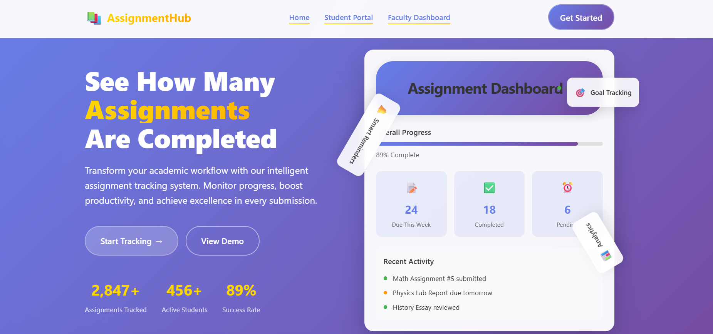

x`# 📘 AssignmentHub

**MERN Stack-Based Assignment Submission & Verification System**  
*Developed for Cloud Computing (BCS601) – VI Semester*  
*Built by K Jeevan Kumar (USN: 4AL22CS067)*

---

## 📌 Project Overview

**AssignmentHub** is a robust and intuitive web application designed using the **MERN stack** to facilitate seamless assignment management between students and faculty.

- 🧑‍🎓 **Students** can securely register and upload assignment PDFs related to **Cloud Computing (BCS601)**.
- 👩‍🏫 **Faculty** members can log in to review, verify, or hold submissions, and track the number of completed assignments in real-time.

> This system improves communication and transparency during assignment evaluation while ensuring streamlined workflows.

---

## 🖼️ Visual Walkthrough

# Sasignet Hub

### 🏠 Home Page


### 👤 Student Registration


### 📤 Assignment Upload


### 🔐 Faculty Login


### 📊 Faculty Dashboard


---

## 📑 Table of Contents

- [Project Overview](#-project-overview)  
- [Visual Walkthrough](#-visual-walkthrough)  
- [Key Features](#-key-features)  
- [Technology Stack](#-technology-stack)  
- [Folder Structure](#-folder-structure)  
- [Installation & Setup Guide](#-installation--setup-guide)  

---

## 🚀 Features

### 👨‍🎓 Student Module

- Register & login using **USN**, **Name**, and **Password**
- Upload a single assignment file for **BCS601 (Cloud Computing)**
- View status of the assignment:  
  - 🕒 Pending  
  - ✅ Completed  
  - ⏸️ Hold

### 👩‍🏫 Faculty Module

- Login with secure subject password
- View all uploaded assignments
- Preview submitted PDF files
- Mark assignments as:  
  - ✅ Completed  
  - ⏸️ Hold (rejected or needs resubmission)
- View live count of completed submissions

---

## 🔧 Technology Stack

### Frontend

- React.js (SPA framework)  
- TailwindCSS (Utility-first CSS framework)  
- React Router (Routing management)  
- Axios (API communication)  
- React Toastify (Notification system)  

### Backend

- Node.js & Express.js (Server & API framework)  
- MongoDB with Mongoose (Database & ORM)  
- JWT (Secure authentication tokens)  
- Bcrypt (Password hashing)  
- Multer (File upload handling for PDFs)  

---

## 📁 Folder Structure

```bash
AssignmentHub/
├── client/                  # React frontend application
│   ├── src/
│   │   ├── pages/           # All React pages (Student, Faculty, etc.)
│   │   ├── components/      # Reusable UI components
│   │   ├── services/        # API request handlers
│   │   ├── context/         # React context for global state
│   │   └── assets/screenshots/  # Project screenshots for docs
│   └── public/              # Static public files
│
├── server/                  # Backend server code
│   ├── models/              # Mongoose schema models
│   ├── routes/              # API route definitions
│   ├── controllers/         # Route handlers & business logic
│   ├── middleware/          # Middleware (auth, file upload, etc.)
│   ├── uploads/             # Stores uploaded assignment PDFs
│   └── config/              # Configurations & environment
│
├── .env                     # Environment variables (not committed)
├── package.json             # Project metadata & dependencies
└── README.md                # Project documentation (this file)

## 🧪 Installation & Setup Guide

Follow these steps to install and run **AssignmentHub** locally.

---

### ⚙️ Prerequisites

- Node.js (v14+)
- MongoDB (local or cloud)
- Git

---

### 📥 Step 1 : Clone the Repository

```bash
git clone https://github.com/jeevankumar812/AssignmentHub.git
cd AssignmentHub
```

### 📥 Step 2 : Backend Setup
```bash
cd backend
npm install
```
### 📥 Step 3 : Setup Environment Variables
```bash
MONGO_URI=your_mongodb_connection_string
JWT_SECRET=your_jwt_secret_key
FACULTY_PASSWORD=your_faculty_password
```

### 📥 Step 4 : Start Backend Server
```bash
npm run server.js
```
**Backend will run at http://localhost:5000**

### 📥 Step 5 : Frontend Setup
```bash
cd client
npm install
npm run dev
```
**Frontend will run at http://localhost:5173**
---
